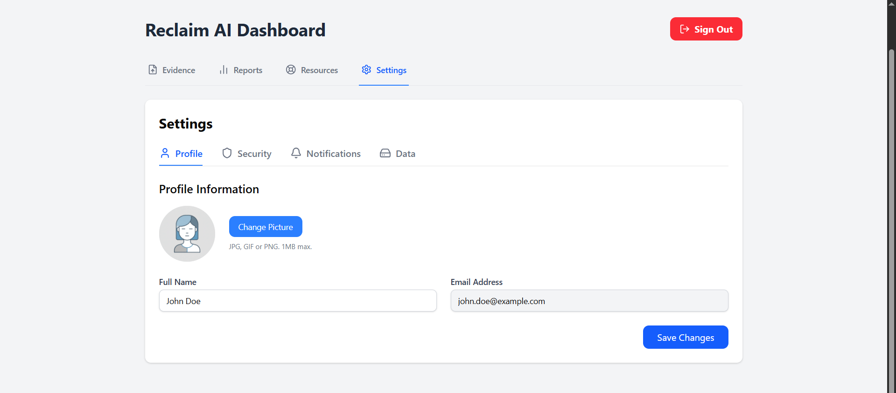

# SafeHer Africa
### *Stay Safe. Stay Smart. Stay Ahead.*
Reclaim empowers survivors of online harassment, blackmail, cyberbullying, doxxing, revenge porn, and digital threats to collect, preserve, and report evidence safely — without fear, without shame, and without leaving a trace.
Built by survivors, for survivors.
Because your story deserves to be heard, and your evidence deserves to be bulletproof.

---
## 📸 Screenshots

### Application Interface
 
 
 
 
 


## 📋 Table of Contents

- [Overview](#-overview)
- [The Problem](#-the-problem)
- [Our Solution](#-our-solution)
- [Features](#-features)
- [Technology Stack](#️-technology-stack)
- [Installation](#-installation)
- [Usage Guide](#-usage-guide)
- [Screenshots](#-screenshots)
- [Security & Privacy](#-security--privacy)
- [Roadmap](#️-roadmap)
- [Project Structure](#-project-structure)
- [Testing](#-testing)
- [Contributing](#-contributing)
- [License](#-license)
- [Support & Resources](#-support--resources)
- [FAQ](#-faq)

---

## 🎯 Overview

Reclaim AI addresses the growing crisis of digital violence against individuals through two integrated pillars:

1. **Digital Safety Learning Hub** -  micro-courses with AI-powered tutoring, interactive quizzes, and reward systems
2. **AI Evidence Collection & Reporting System** - Secure, encrypted vault for documenting abuse with automated harm detection and legal report generation

Our mission is to transform digital safety education from reactive to proactive, empowering women and girls with knowledge and tools before, during, and after experiencing digital violence.

---

## 🚨 The Problem

Across Africa, digital violence against women is reaching crisis levels. One in three women experience online harassment, yet over 80% never report incidents due to lack of evidence, fear of retaliation, or insufficient awareness of their digital rights. Traditional evidence collection methods are unreliable, screenshots can be dismissed, and legal systems often lack the expertise to handle digital abuse cases.

Women face sophisticated threats including deepfake manipulation, romance scams, image-based abuse, doxxing, and coordinated harassment campaigns. Without proper tools and education, victims remain vulnerable while perpetrators act with impunity. The gap between the sophistication of digital abuse and victims' ability to protect themselves continues to widen.

---

## ✨ Our Solution

Reclaim AI bridges this critical gap through intelligent technology and accessible education:

- **AI-Powered Evidence Analysis** - Automatically detects and highlights harassment, threats, hate speech, sexual abuse, blackmail, and manipulation in uploaded content
- **Legal-Grade Documentation** - Cryptographic timestamping, hashing, and chain-of-custody preservation ensures evidence integrity for legal proceedings
- **Learning** - Transform complex safety concepts into engaging 2-5 minute courses with real rewards and personalized AI tutoring
- **Anonymous Reporting Channels** - Safe pathways to report abuse to NGOs, authorities, and support organizations without fear

---

## 🎯 Features

#### 🤖 AI Digital Safety chatbot
Your personal safety coach available 24/7:
- Conversational learning tailored to your pace
- Real-time answers to safety questions
- Personalized risk assessments
- Scenario-based guidance
- Quiz preparation and knowledge checks

#### 🎮 Gamification System
Learning meets motivation:
- **Earn Tokens** - Redeem for premium features or donate to safety organizations
- **Unlock Badges** - 12+ achievements from "Password Guardian" to "Reality Checker"
- **Level Up** - Progress from Safety Novice to Digital Defense Expert
- **Daily Streaks** - Build consistent safety habits
- **Leaderboards** - Compete with community (anonymously)

#### 📊 AI-Personalized Curriculum
Smart learning paths adapt to you:
- Analyzes browsing behavior for risk patterns
- Recommends courses based on your digital habits
- Adjusts difficulty to your performance
- Prioritizes urgent safety gaps

---

### 🛡️ AI Evidence Collection & Reporting System

#### 📸 Multi-Format Evidence Upload
Capture every form of digital abuse:
- Screenshots and images
- Audio recordings
- Video files
- PDF documents
- Text messages
- WhatsApp chat exports
- Telegram conversation dumps
- Screen recordings
- Camera capture in-app
- Email threads

#### 🔍 AI Harm Detection Engine
Intelligent content analysis identifies:
- **Harassment** - Repeated unwanted contact, stalking patterns
- **Threats** - Violence, intimidation, coercion
- **Hate Speech** - Gender-based slurs, discriminatory language
- **Sexual Abuse** - Explicit content sharing, grooming, solicitation
- **Blackmail** - Extortion attempts, revenge porn threats
- **Manipulation** - Gaslighting, psychological abuse tactics
- **Doxxing** - Privacy violations, personal information exposure

The AI highlights harmful sections, provides severity scores (0-100), and suggests categorization.

#### 🔒 Secure Evidence Vault
Military-grade protection for your documentation:
- **End-to-End Encryption** - AES-256 encryption for all files
- **Biometric/PIN Lock** - Dual-layer authentication required for access
- **Zero-Knowledge Architecture** - We cannot access your evidence, ever
- **Cryptographic Timestamping** - Legal-grade proof of when evidence was collected
- **SHA-256 Hashing** - Verifiable evidence integrity for court proceedings
- **Offline-First Storage** - Works without internet, syncs when available
- **Auto-Delete Options** - Scheduled destruction for sensitive files

#### 🗂️ Smart Organization
AI automatically categorizes evidence:
- By abuse type (harassment, threats, etc.)
- By perpetrator
- By timeline
- By severity level
- Custom tags and notes

#### 📄 Case Report Generator
Professional documentation in minutes:
- **Comprehensive Summary** - AI-generated incident overview
- **Labeled Evidence** - All files organized with harm indicators highlighted
- **Timeline Visualization** - Chronological abuse progression
- **Severity Analysis** - AI risk scoring and pattern detection
- **Legal Recommendations** - Country-specific next steps
- **NGO Suggestions** - Relevant support organizations
- **Export Formats** - PDF, DOCX, secure share links

#### 🆘 Anonymous Reporting
Safe channels to seek help:
- Report to vetted NGOs
- Submit to cybercrime units
- Contact legal aid organizations
- Reach counseling services
- All without revealing identity

---

## 🛠️ Technology Stack
 
Category      Technologies
Frontend           React 18, TypeScript, TailwindCSS 3.x, Vite, shadcn/ui
State Management   React Context API, React Query
Backend             Supabase (Auth, Database, Storage)
AI/ML Models        OpenAI GPT-4 (Tutor), Google Cloud Vision AI (Image Analysis), Hugging Face Transformers (Text Classification), Deepware Scanner API (Deepfake Detection)
Security         AES-256 Encryption, SHA-256 Hashing, bcrypt, JWT Tokens
PDF Generation    jsPDF, PDFKitPackage ManagerBun (with npm fallback)
Development      Vite, TypeScript, ESLint, PostCSS
Deployment        Vercel (Frontend), Supabase (Backend)CI/CDGitHub Actions

---

## 🚀 Installation

### Prerequisites

Before you begin, ensure you have:
- **Node.js** v18.0.0 or higher ([Download](https://nodejs.org/))
- **npm** v9.0.0+ or **yarn** v1.22.0+
- **Suabase account** ([Create free account](https://supabase.com//))
- **AI API keys** (OpenAI, Google Cloud Vision)

### Step-by-Step Setup

#### 1. Clone the Repository
```bash
git clone https://github.com/Olaweb24/reclaim-ai-app.git
cd reclaim-ai-app
```

#### 2. Install Dependencies
```bash
npm install
# or
yarn install
```

#### 3. Configure Environment Variables
```bash
cp .env.example .env
```

Edit `.env` with your credentials:
```env
# Firebase Configuration
VITE_FIREBASE_API_KEY=your_firebase_api_key
VITE_FIREBASE_AUTH_DOMAIN=your-project.firebaseapp.com
VITE_FIREBASE_PROJECT_ID=your-project-id
VITE_FIREBASE_STORAGE_BUCKET=your-project.appspot.com
VITE_FIREBASE_MESSAGING_SENDER_ID=your_sender_id
VITE_FIREBASE_APP_ID=your_app_id

# AI Service APIs
VITE_OPENAI_API_KEY=sk-your_openai_key
VITE_GOOGLE_CLOUD_VISION_KEY=your_google_vision_key
VITE_DEEPWARE_API_KEY=your_deepfake_detection_key

# Security
VITE_ENCRYPTION_KEY=your_32_character_encryption_key
VITE_JWT_SECRET=your_jwt_secret_key

# Feature Flags
VITE_ENABLE_ANONYMOUS_MODE=true
VITE_ENABLE_OFFLINE_MODE=true
```

#### 4. Initialize Supabase
# Install Supabase CLI
npm install -g supabase

# Login to Supabase
supabase login

# Link to your project
supabase link --project-ref your-project-ref

# Push database migrations
supabase db push
#### 5. Run Database Setup
```bash
# Create Firestore indexes and security rules
npm run db:setup

# Seed initial course content
npm run db:seed
```

#### 6. Start Development Server
```bash
npm run dev
```

Navigate to `http://localhost:5173` in your browser.

#### 7. Build for Production
```bash
# Create optimized production build
npm run build

# Preview production build locally
npm run preview

# Deploy to Firebase Hosting
npm run deploy
```

---

## 📖 Usage Guide

### Quick Start (5 Minutes to Safety)

1. **Sign Up**
   - Visit Reclaim AI homepage
   - Click "Get Started"
   - Register with email or phone number
   - Verify email

2. **Explore Dashboard**
   - View your personalized safety score
   - See AI-recommended courses
   - Check today's safety tip

3. **Take a Course**
   - Click "Start Learning" → "Password Security 101"
   - Read scenario: "Joy uses 'Joy2023!' everywhere"
   - Complete 3-question quiz

4. **Chat with AI chatbot**
   - Click courses bottom-left
   - Ask: "How do I create a strong password?"
   - Get personalized guidance

#### For Evidence Collection: Document Abuse Safely

1. **Access data**
   - From settings-data, tap "export data"

2. **Upload Evidence**
   - Tap "click to upload" button
   - Select upload method:
     - 📸 Take photo
     - 🖼️ Choose from gallery
     - 💬 Upload chat screenshot
     - 📁 Import WhatsApp export

3. **AI Analysis**
   - AI automatically scans content
   - Harmful sections highlighted in red
   - Severity score displayed (0-100)
   - Suggested categories applied

4. **Organize Evidence**
   - View timeline of incidents
   - Filter by perpetrator, type, or date
   - Add custom tags
   - Attach related evidence

5. **Generate Case Report**
   - When ready, tap "Generate Report"
   - AI compiles all evidence
   - Review generated summary
   - Export as PDF or DOCX
   - Send anonymously to authorities or save securely

---


## 🔐 Security & Privacy

### Our Security Commitment

Reclaim AI treats your safety and privacy as sacred. We've built military-grade security into every layer of the platform because we understand that for survivors of abuse, security isn't just a feature—it's survival.

---

### Data Protection

#### End-to-End Encryption
- **AES-256 Encryption** - All evidence files encrypted before upload
- **Zero-Knowledge Architecture** - We cannot access your evidence, period
- **Encrypted Backups** - Cloud storage uses separate encryption keys
- **Secure Key Management** - Keys derived from your PIN/biometric, never stored

#### Evidence Integrity
- **SHA-256 Hashing** - Every file gets a unique cryptographic fingerprint
- **Blockchain Timestamping** - Proof of evidence existence at specific time
- **Chain-of-Custody Logging** - Every access and modification tracked
- **Tamper Detection** - Instant alerts if evidence is modified

#### Secure Authentication
- **Multi-Factor Authentication** - Email/SMS OTP required
- **Biometric Protection** - Fingerprint/Face ID for evidence vault
- **PIN Backup** - Offline access with secure PIN
- **Session Management** - Auto-logout after inactivity

---

### Privacy Guarantees

#### Data Minimization
- Collect only essential information
- No social media tracking
- No location tracking
- No behavioral profiling for ads

#### User Control
- **Export Your Data** - Download all your information anytime
- **Delete Everything** - One-click permanent account deletion
- **Selective Sharing** - Choose exactly what to share in reports
---

### Compliance & Standards

#### Legal Compliance
- **GDPR Compliant** - Full European data protection compliance
- **African Union Convention** - Adheres to Malabo Convention standards
- **HIPAA-Ready** - Healthcare-grade privacy for trauma support
- **SOC 2 Type II** - Third-party security audit certified

#### Evidence Admissibility
- **Forensic Standards** - Meets legal requirements for digital evidence
- **Metadata Preservation** - Original file properties maintained
- **Audit Trail** - Complete log of evidence handling
- **Expert Testimony** - Technical documentation for court use

---

#### What We Never Do
❌ Sell your data  
❌ Share with advertisers  
❌ Track across websites  
❌ Read your evidence  
❌ Store passwords in plain text  
❌ Use your data for AI training  
❌ Require real name  
❌ Log IP addresses long-term  

---

### Security Best Practices for Users

1. **Use Strong PIN** - 6+ digits, not birthdate or pattern
2. **Enable Biometrics** - Adds extra layer of protection
3. **Regular Backups** - Export evidence to encrypted external drive
4. **Update Regularly** - Install app updates for security patches
5. **Verify Hash Values** - Check evidence integrity before legal submission
6. **Secure Your Device** - Use device password, enable Find My Phone
7. **Public WiFi Warning** - Avoid uploading evidence on public networks
8. **Trust No One** - Never share your PIN, even with support staff

---

> ⚠️ **Critical Disclaimer**: While Reclaim AI uses industry-leading security practices, no system is 100% unhackable. For life-threatening situations, contact local authorities immediately. This platform empowers you with tools but cannot guarantee physical safety. Always consult legal professionals for case-specific security advice.

---

## 🗺️ Roadmap

### ✅ Current Features (v1.0 - Released November 2024)

- [x] Complete authentication system (Email, Phone, OTP, Social Login)
- [x] digital safety courses
- [x] Evidence vault with AES-256 encryption
- [x] Multi-format evidence upload (images, video, audio, chats)
- [x] AI harm detection for harassment, threats, abuse
- [x] Professional case report generator (PDF/DOCX)
- [x] Anonymous reporting to NGOs and authorities
- [x] Offline mode with local storage
- [x] Mobile-responsive design 

---

###  Future Vision

#### Multi-Language Support

#### Enhanced AI Features
- [ ] Voice-to-text evidence documentation
- [ ] Sentiment analysis for emotional impact scoring
- [ ] Pattern recognition across multiple incidents
- [ ] Predictive escalation warnings
- [ ] AI-generated safety action plans

#### Communication & Support
- [ ] Live chat with trained counselors
- [ ] Peer support forums (moderated, anonymous)
- [ ] Video call integration with legal aid partners
- [ ] SMS alert system for crisis situations
- [ ] WhatsApp bot for quick safety tips

#### Platform Integrations
- [ ] Direct integration with Kenya Cybercrime Unit
- [ ] Partnership with African legal aid networks
- [ ] NGO dashboard for receiving reports
- [ ] Export to case management systems
- [ ] API for third-party safety apps

#### Mobile Applications
- [ ] iOS native app (beta testing)
- [ ] Android native app (development)
- [ ] Offline-first architecture for low-connectivity areas
- [ ] Push notifications for safety alerts
- [ ] Widget for quick evidence capture

#### Advanced Learning
- [ ] VR/AR safety simulations
- [ ] Live workshops with experts
- [ ] Certification program for digital defenders
- [ ] Course creation platform for communities
- [ ] Adaptive learning powered by reinforcement learning

#### Evidence Intelligence
- [ ] Blockchain-based evidence verification
- [ ] AI-powered legal document drafting
- [ ] Automatic witness statement generation
- [ ] Cross-platform evidence aggregation (collect from multiple sources)
- [ ] Real-time evidence integrity monitoring

#### Community Safety
- [ ] Group safety features (alert networks)
- [ ] Community threat intelligence sharing
- [ ] Crowdsourced scammer database
- [ ] Regional safety dashboards
- [ ] Mentorship matching (survivors helping survivors)

#### Expansion & Scale
- [ ] Coverage across all 54 African countries
- [ ] Integration with UN Women initiatives
- [ ] Government partnerships for policy reform
- [ ] School and university programs
- [ ] Corporate digital safety training modules

#### Technical Innovations
- [ ] Edge AI for fully offline harm detection
- [ ] Homomorphic encryption for privacy-preserving analysis
- [ ] Decentralized evidence storage (Web3)
- [ ] Quantum-resistant encryption
- [ ] Open-source AI models for transparency

---

### 💡 Considering for Backlog

- Browser extension for real-time scam warnings
- Smart contract-based evidence notarization
- Integration with police bodycam systems
- AI voice assistant for hands-free evidence capture
- Automated legal form filling for common case types
- Child safety mode (age-appropriate courses)
- Employer dashboard for workplace digital safety
- Insurance integration for cybercrime claims

---

###  Long-Term Impact Goals

By 2030, we envision Reclaim AI as:
- **The** digital safety platform trusted by 10 million African women
- Integrated into national digital rights frameworks across 25+ countries
- Contributing to 50% reduction in unreported digital violence cases
- Providing evidence leading to 100,000+ successful legal outcomes
- Training 1 million girls in schools through partnerships
- Open-source standard for ethical evidence collection globally

---

>  **Have ideas for features?** We'd love to hear from you! Submit feature requests via GitHub Issues or join our community Discord to shape the roadmap together.

---
#### project structure
reclaim-ai-app/
├── public/
│   ├── screenshots/              # images
│   ├── gebeya.webp/                   
│   └── favicon.ico                 
│
├── src/
│   ├── assets/                   # Static assets
│   │
│   ├── components/
│   │   ├── auth/
│   │   │   ├── LoginForm.jsx
│   │   │   ├── SignupForm.jsx
│   │   │   ├── OTPVerification.jsx
│   │   │   └── BiometricSetup.jsx
│   │   │
│   │   ├── dashboard/
│   │   │   ├── DashboardHome.jsx
│   │   │   ├── QuickActions.jsx
│   │   │   ├── ProgressBar.jsx
│   │   │   └── SafetyTips.jsx
│   │   │
│   │   ├── courses/
│   │   │   ├── CourseLibrary.jsx
│   │   │   ├── CoursePlayer.jsx
│   │   │   ├── QuizComponent.jsx
│   │   │   ├── ScenarioCard.jsx
│   │   │   └── BadgeDisplay.jsx
│   │   │
│   │   ├── ai-tutor/
│   │   │   ├── ChatInterface.jsx
│   │   │   ├── MessageBubble.jsx
│   │   │   └── QuickPrompts.jsx
│   │   │
│   │   └── [other component directories]
│   │
│   ├── contexts/                 # React Context providers
│   │
│   ├── hooks/                    # Custom React hooks
│   │
│   ├── lib/                      # Utility libraries and helpers
│   │
│   ├── pages/                    # Page-level components
│   │
│   ├── services/                 # API and external service integrations
│   │
│   ├── App.tsx                   # Root application component
│   ├── App.css                   # Global application styles
│   ├── index.css                 # Base styles and Tailwind imports
│   ├── main.tsx                  # Application entry point
│   └── vite-env.d.ts            # Vite TypeScript declarations
│
├── supabase/                     # Supabase configuration and migrations
│
├── .env.example                  # Environment variables template
├── .eslintrc.cjs                # ESLint configuration
├── .gitignore                    # Git ignore rules
├── bun.lock                      # Bun package lock file
├── components.json               # shadcn/ui components config
├── index.html                    # HTML entry point
├── package.json                  # NPM dependencies and scripts
├── package-lock.json            # NPM lock file
├── postcss.config.js            # PostCSS configuration
├── README.md                     # Project documentation
├── tsconfig.json                # TypeScript root config
├── tsconfig.app.json            # TypeScript app config
├── tsconfig.node.json           # TypeScript Node config
└── vite.config.ts               # Vite bundler configuration
│
